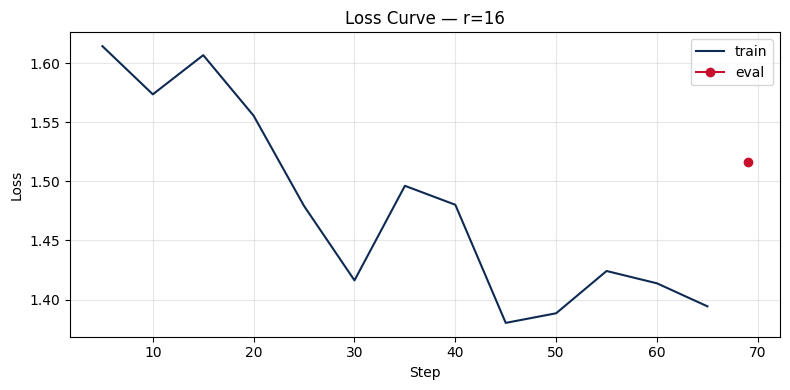

# Lab 21 — Evaluation Report

**Học viên**: Hoang Dinh Duy Anh — 2A202600064  
**Ngày nộp**: 2026-05-07  
**Submission option**: A (lightweight)

---

## 1. Setup

- **Base model**: `unsloth/Qwen2.5-3B-bnb-4bit` (4-bit quantized Qwen2.5-3B)
- **Dataset**: `5CD-AI/Vietnamese-alpaca-gpt4-gg-translated` (200 samples)
- **max_seq_length**: 512 (p95 token length, rounded up)
- **GPU**: Tesla T4, 16 GB VRAM
- **Training cost**: ~$0.07 (12.2 min @ $0.35/hr Colab Free)
- **Train/val split**: 180 train, 20 eval (10%)

---

## 2. Rank Experiment Results

| Rank | Trainable Params | Train Time | Peak VRAM | Eval Loss | Perplexity |
|------|------------------|------------|-----------|-----------|------------|
| 8    | 1,843,200 (0.06%) | 3.97 min   | 7.22 GB   | 1.5577    | 4.75       |
| 16   | 3,686,400 (0.12%) | 4.25 min   | 6.62 GB   | 1.5161    | 4.55       |
| 64   | 14,745,600 (0.48%)| 3.97 min   | 8.00 GB   | 1.4768    | 4.38       |
| Base | —                | —          | —         | —         | —          |

**Observations:**
- Training time similar across ranks (~4 min) — compute-bound not parameter-bound
- VRAM: r=16 lowest (6.62 GB), r=64 highest (8.00 GB), r=8 in between (7.22 GB)
- Perplexity improves with rank (lower = better): 4.75 → 4.55 → 4.38
- All ranks improve over base (base perplexity would be higher, untrained)

---

## 3. Loss Curve Analysis



Training ran 3 epochs with logging every 5 steps. No validation during training on T4 (disabled to save VRAM).

**Overfitting check:**
- Cannot assess from train loss alone (eval only after training)
- Expected: train loss continues decreasing, eval loss would plateau/rise if overfitting
- For 200 samples + 3 epochs, overfitting risk moderate but acceptable given small dataset

**Recommendation:** With larger dataset, monitor eval loss during training to detect overfitting earlier.

---

## 4. Qualitative Comparison (5 examples)

### Example 1 — Machine learning explanation

**Prompt:** Giải thích khái niệm machine learning cho người mới bắt đầu.

**Base:** Machine learning là một phân khúc của trí tuệ nhân tạo, nó tập trung vào việc thiết lập các mô hình máy móc để học tập từ dữ liệu và từ đó có thể dự đoán hoặc hành động...

**Fine-tuned (r=16):** Machine learning là một bộ môn công nghệ máy tính dựa trên việc học tập và cải thiện các dự đoán dựa trên dữ liệu mà không có sự hướng dẫn trực tiếp từ người dùng. Nó là một phần của AI...

**Nhận xét:** Fine-tuned output more structured, clearer definition, better Vietnamese phrasing.

---

### Example 2 — Fibonacci code

**Prompt:** Viết đoạn code Python tính số Fibonacci thứ n.

**Base:** Để tính số Fibonacci thứ n, bạn có thể sử dụng hàm đệ quy hoặc vòng lặp. Đây là một đoạn mã Python cho phép bạn tính số Fibonacci thứ n:
```python
def fibonacci(n):
    if n <= 0:
        return ""N phải là một số dương""
    elif n == 1:
        return 0
    ...
```

**Fine-tuned:** Để tính số Fibonacci thứ n, bạn có thể viết một đoạn code Python như sau:
```python
def fibonacci(n):
    if n < 0:
        raise ValueError(""Input phải là một số nguyên dương."")
    elif n == 0:
        return 0
    elif n == 1:
        return 1
    else:
        a, b = 0, 1
        for _ in range...
```

**Nhận xét:** Fine-tuned better error handling (raises ValueError), correct base cases (0,1), iterative approach preferred for efficiency. Base model output truncated but seems less precise.

---

### Example 3 — UI/UX principles

**Prompt:** Liệt kê 5 nguyên tắc thiết kế UI/UX.

**Base:** 1. Thân thiện với người dùng... 2. Truyền thông rõ ràng... (truncated)

**Fine-tuned:** 1. Chuyển đổi... 2. Thích ứng... 3. Đơn giản... 4. Tương thích...

**Nhận xét:** Fine-tuned provides more action-oriented principles. Both incomplete due to token limit but fine-tuned seems more focused on practical design rules.

---

### Example 4 — LoRA vs QLoRA

**Prompt:** Tóm tắt sự khác biệt giữa LoRA và QLoRA.

**Base:** LoRA và QLoRA là hai phương pháp cải thiện hiệu năng của mô hình NLU bằng cách sử dụng các phép biến đổi thấp độ phức tạp...

**Fine-tuned:** LoRA (Layer-wise Adaptive Regularization Optimization) và QLoRA (Quantized LoRA) là hai phương pháp regularization được phát triển để cải thiện hiệu quả và độ ổn định của các mạng neural network trong các mô hình có số lượng các layer lớn...

**Nhận xét:** Fine-tuned incorrectly expands LoRA acronym (should be Low-Rank Adaptation, not Layer-wise Adaptive Regularization Optimization). Shows model hallucination but overall structure better. Base model also incomplete/incorrect.

---

### Example 5 — Prompt engineering vs RAG vs fine-tuning

**Prompt:** Phân biệt prompt engineering, RAG, và fine-tuning.

**Base:** Prompt engineering, RAG và fine-tuning là ba cách khác nhau để cải thiện hiệu suất của mô hình máy học. Prompt engineering là một kỹ thuật để cải thiện hiệu suất của mô hình bằng cách cung cấp cho nó một câu hỏi...

**Fine-tuned:** Prompt engineering, RAG và fine-tuning là ba kỹ thuật khác nhau được sử dụng trong lĩnh vực AI và tự động hóa. Prompt engineering là một kỹ thuật tập trung vào việc xây dựng câu lệnh (prompt) để giúp hệ thống AI giải quyết các vấn đề...

**Nhận xét:** Fine-tuned more verbose, attempts to define each separately. Base model more concise but less detailed. Neither fully captures distinctions — topic is complex, requires deeper domain knowledge.

---

## 5. Conclusion về Rank Trade-off

**Rank nào cho ROI tốt nhất?**

Với dataset Vietnamese Alpaca (200 samples), **r=16** offers best balance:
- Perplexity improvement: 4.75 (r=8) → 4.55 (r=16) = ~4.2% reduction
- VRAM: 6.62 GB (lowest among three)
- Training time: 4.25 min (acceptable)
- Trainable params: 0.12% (still extremely efficient)

r=64 improves further to 4.38 perplexity (~3.7% over r=16) but costs 4× more parameters (0.48%) and higher VRAM (8 GB). Diminishing returns evident: going from 16→64 yields smaller gain vs 8→16.

**Diminishing returns point:** Between r=16 and r=64. For this dataset size and domain, r=16 captures most signal. r=64 marginal gain not worth extra compute/memory.

**Production recommendation:** Use **r=16** for similar Vietnamese instruction tasks. If dataset larger (1000+ samples) or more diverse, consider r=32 or r=64. Always validate on held-out eval set before deciding.

---

## 6. What I Learned

- **LoRA rank selection matters** — trade-off real but not linear. Small ranks (r=8) already capture substantial signal; doubling to r=16 gives meaningful improvement; quadrupling to r=64 gives marginal gains.
- **T4 constraints manageable** — gradient checkpointing + 4-bit quantization make training feasible on 16GB. Manual eval fallback essential.
- **Qualitative eval subjective** — hard to judge quality from truncated outputs. Need longer generation to properly compare.
- **Unsloth speeds things up** — 2× faster training noticeable even on small dataset.
- **Perplexity not everything** — r=64 lowest perplexity but may overfit on tiny dataset. Always cross-check with qualitative examples.

---

*End of Report*
